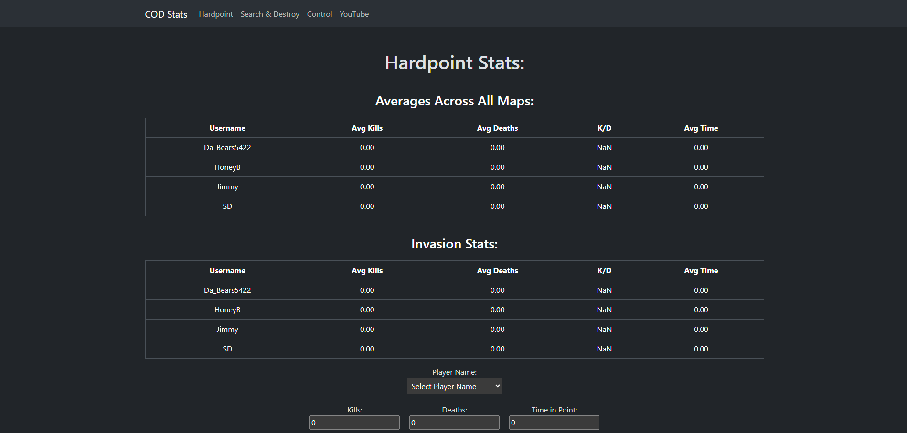

# CodApp - Call of Duty Stat Tracking Application
## Description
This is an application designed to track Call of Duty statistics for a team of 4 players. Currently, the application is hard-coded to only be used for a specific team of 4 players. In the future there are plans to expand so users can create and join their own teams with their own usernames. The tech stack includes but is not limited to HTML, CSS, JS, express, mongoose, bootstrap, react, and more.   
## Usage
This project is currently meant for use on your own local machine as it does not have a team joining mechanism yet. To use you must clone the project from GitHub and use the terminal to type in "npm run develop".

Below are screenshots of the application running:

## Credits
This project was done in its entirety by [Ben Pavlis](https://github.com/bpavlis)